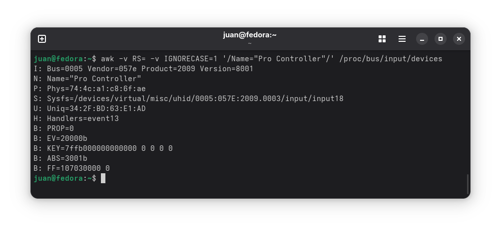

# Vala with SDL2 - Bluetooth Joystick PoC

A proof of concept using SDL2 with Vala to read Bluetooth joystick buttons being pressed.

**And what is [SDL](https://www.libsdl.org/)?**

Simple DirectMedia Layer is a cross-platform development library designed to provide low level access to audio, keyboard, mouse, joystick, and graphics hardware via OpenGL and Direct3D. 

## How to use this repository?

1. Install required depdendencies first:

    - On Debian/Ubuntu:
        ```sh
        sudo apt-get install valac libvala-*-dev libgtk-4-dev libsdl2-dev
        ```
    
    - On Fedora:
        ```sh
        sudo dnf install vala libvala-devel gtk4-devel sdl2-compat-devel
        ```

2. Then, compile the source code running next command:

    ```sh
    valac --pkg sdl2 bluetooth_joystick_test.vala
    ```

3. Connect a Bluetooth Joystick to your computer.

4. Execute the application:

    ```sh
    ./bluetooth_joystick_test
    ```

## Concepts:

- **hat:** the D-pad of many joysticks and gamepads does not appear as buttons, but as a “hat” in SDL.

- **Joystick ID:** all Joysticks have an associated identification number that identifies them from other devices connected to our computer. To know waht ID has our controller, we can run next command:

    ```sh
    awk -v RS= -v IGNORECASE=1 '/Name="$CONTROLLER_NAME"/' /proc/bus/input/devices
    ```

    

    > **NOTE:** in this case, my identification number is `0`, recognizable by the property `B: PROP=0`.

- **SDL init:** SDL needs to startup first to recognize devices likes controllers or joysticks.